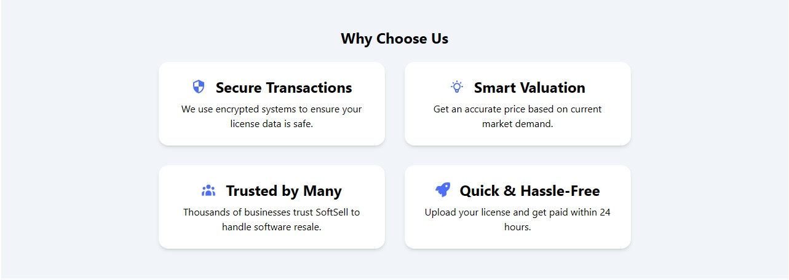
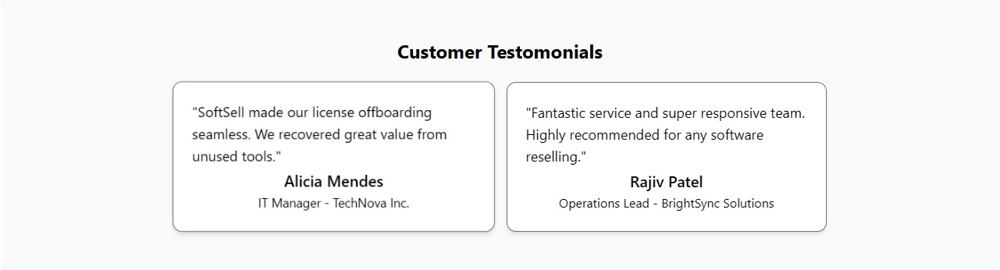
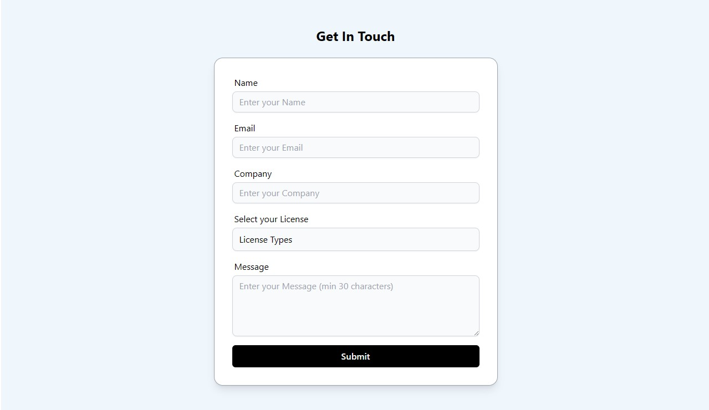

# Softsell

Softsell is a marketplace to buy, sell, and get valuations for new or used software licenses. Maximize the value of your unused software.

🔗 **Live Here:** [softsell-myapp.netlify.app](https://softsell-myapp.netlify.app)

---

## 🛠 Tech Stack Used

- **HTML**
- **Tailwind CSS** – for fast and responsive UI styling
- **React** – for building the application
- **Netlify** – for deployment
- **GitHub** – for version control & documentation

---

## 🚀 Getting Started

To run this project locally, make sure you have `node` and `npm` or `yarn` installed.

```bash
# Install Vite + React app
npm create vite@latest softsell -- --template react
cd softsell

# Install dependencies
npm install

# Run the development server
npm run dev
````

Or with Yarn:

```bash
yarn create vite softsell --template react
cd softsell
yarn
yarn dev
```

---

## ✅ Features Implemented

* ✅ License Valuation Checker
* ✅ Sell Your License Interface
* ✅ Contact Form with Frontend Validation
* ✅ Light & Dark Mode Toggle

---

## 🎨 Design Features

* Color-coded sections for better visual separation
* Seamless Light and Dark Theme support

### 🌞 Light Mode:


### 🌙 Dark Mode:


---

## Differenct Sections

**Benefits Section**



**Reviews Section**



**Contact Form**




## ⏱ Time Spent

**Total Time: \~10 Hours**

* 💻 7 Hours – Development & Debugging
* 🎨 3 Hours – Design & Responsiveness

---

## 📁 Folder Structure

Organized for scalability and maintainability:

```
src/
├── assets/         # All images and media files
├── components/     # Reusable UI components
├── json-data/      # Static JSON data files
├── layouts/        # Page layout structures
├── pages/          # Route-specific pages
├── redux/          # Redux logic for theme toggle
├── App.jsx
├── index.css
└── main.jsx        # App entry point

index.html          # Main HTML entry
```
