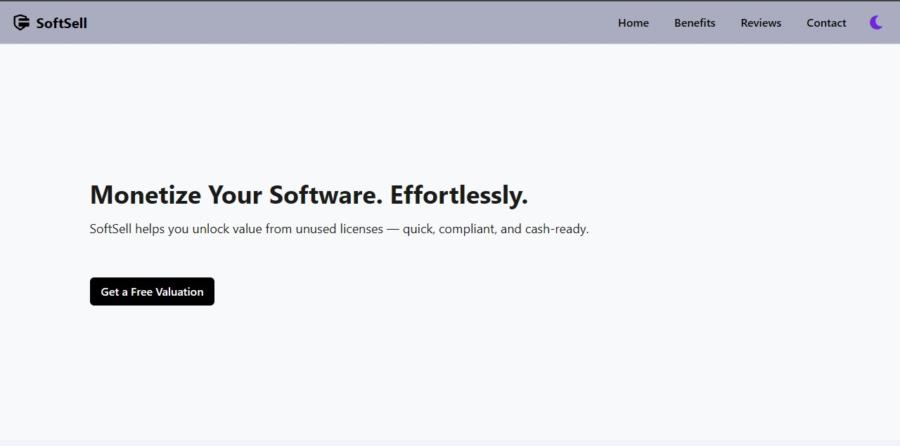
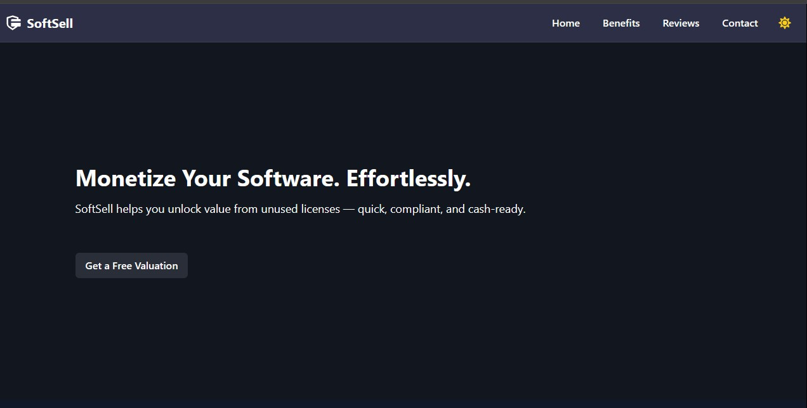

# Softsell

Softsell is a marketplace to buy, sell, and get valuations for new or used software licenses. Maximize the value of your unused software.

Live Here: [softsell-myapp.netlify.app](https://softsell-myapp.netlify.app)

## Tech Stack Used

`Html`

`Tailwind CSS` for styling

`React` for Application Building

`Netlify` for Deployment

`GitHub` for Repository and Documentation

## Feature Implemented

- Check Lisence Valuation
- Sell the Lisence
- Contact Form (Validation only)
- Light and Dark Mode for user preference.

## Design Features

- Implement Different Colors for sepration of sections.
- Colors sepration for Light and Dark Theme.

Light Mode:

Dark Mode:

## Time spent

Total Time Spent is 10hrs.

- 7 Hours for Coding and Debugging.
- 3 Hours for Design and Responsiveness

features implemented, design choices, and time spent

## Folder Structure

Professional folder structure for maintainablity and scalability.

    src/
        assets          - All Images, media in projects
        components      - Reusable components
        json-data       - All Data JSON used in app
        layouts         - Different Layout Section
        pages           - Pages shown in app
        redux           - Redux for Theme Modes
        app.jsx         
        index.css       
        main.jsx        - Wrapper for whole app

    index.html          - Starting point of all app

